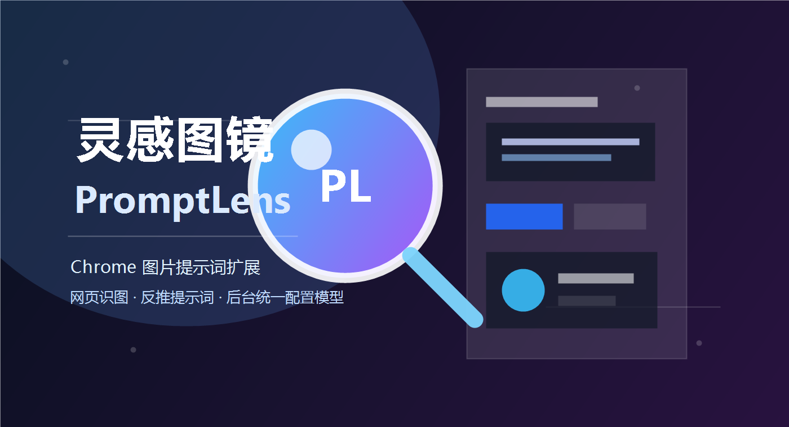

# 灵感图镜 PromptLens

灵感图镜 PromptLens 是一个 Chrome 浏览器扩展，用于分析网页图片，并将图片内容反推为可编辑、可复制、可用于生图的提示词。



当前版本采用“扩展客户端 + 服务器后台”架构：

- 扩展端只负责网页交互、图片采集、提示词编辑和结果查看。
- API Key、模型、Base URL 只保存在服务器后台。
- 普通扩展用户不需要、也看不到模型供应商配置。
- 扩展默认请求正式后端：`https://impro.n8nmydomain.com`。

## 功能特性

- 在网页图片左上角显示快捷识别按钮
- 点击图片按钮后自动分析图片内容
- 生成精简版 / 完整版提示词
- 支持中文 / 英文提示词切换
- 支持结构化查看提示词内容
- 支持正向提示词和负面提示词编辑
- 支持一键复制提示词
- 支持在弹窗内直接生图
- 支持选择生图比例：1:1、3:4、4:3、9:16、16:9
- 支持在新页面查看和下载生成图片
- 深色液态玻璃风格界面

## 架构说明

```text
网页图片
  ↓
Chrome 扩展 content.js
  ↓
Chrome 扩展 background.js
  ↓
本地或 VPS 后端 /api/analyze、/api/generate
  ↓
模型服务商 API
```

职责边界：

- `content.js`：网页注入、悬浮按钮、主弹窗交互。
- `background.js`：扩展后台，只请求后端 API，并保存 viewer 临时数据。
- `background-settings.js`：只保存公共客户端偏好，例如后端地址、自动识别、默认比例、默认张数。
- `server/server.js`：后端 API、管理员登录、敏感配置保存、模型服务商调用。

## 本地启动

### 1. 启动后端

```bash
cd server
copy .env.example .env
npm start
```

然后打开：

- 后端健康检查：`http://127.0.0.1:8787/health`
- 管理员后台：`http://127.0.0.1:8787/admin`

首次使用前，请在 `server/.env` 里修改：

```bash
ADMIN_PASSWORD=change-this-admin-password
```

管理员登录后配置识图和生图的服务商、Base URL、模型和 API Key。

### 2. 加载扩展

1. 打开 Chrome，进入 `chrome://extensions/`。
2. 开启右上角的「开发者模式」。
3. 点击「加载已解压的扩展程序」。
4. 选择本项目所在文件夹。
5. 确认本地后端已启动。
6. 打开任意包含图片的网页，刷新页面后使用扩展。

## 后端接口

扩展只依赖两个业务接口：

- `POST /api/analyze`：分析图片并返回提示词结构。
- `POST /api/generate`：根据提示词生成图片。

后端还提供：

- `GET /health`：健康检查。
- `GET /admin`：管理员设置页。
- `POST /admin/settings`：保存服务器端模型配置。

## 支持的服务商

后端第一版支持：

- `Gemini`
- `OpenAI Compatible`

识图和生图可以分别选择不同服务商。

## 隐私与配置说明

- 扩展端不保存 API Key、模型名称、模型 Base URL。
- 扩展端只保存公共偏好：后端 API 地址、自动识别开关、生图开关、默认比例、默认张数。
- 敏感配置保存在服务器端的 `server/data/settings.json`。
- `server/data/settings.json` 已加入 `.gitignore`，不要提交真实密钥。
- 图片识别和生图请求会发送到你部署和管理的后端，再由后端调用模型服务商。

更完整的说明见 [PRIVACY.md](./PRIVACY.md)。

## Chrome 权限说明

- `storage`：保存扩展公共偏好。
- `tabs`：打开结果查看页，以及在必要时处理当前标签页截图兜底。
- `<all_urls>`：在网页图片上注入识别按钮，并在用户主动点击后读取对应图片。
- `https://impro.n8nmydomain.com/*`：请求正式后端。
- `http://localhost:8787/*`、`http://127.0.0.1:8787/*`：请求本地开发后端。

扩展已默认指向 `https://impro.n8nmydomain.com`。本地开发时，也可以把后端 API 地址改为 `http://127.0.0.1:8787`，并确认 `manifest.json` 保留本地后端权限。

## 项目结构

```text
.
├── manifest.json              # Chrome Manifest V3 配置
├── background-settings.js      # 扩展公共偏好读写
├── background.js               # 扩展后台，调用后端 API 与保存 viewer 数据
├── content.js                  # 网页注入逻辑、图片按钮、主弹窗交互
├── content.css                 # 主弹窗与网页注入样式
├── viewer.html                 # 生图结果查看页
├── viewer.js                   # 生图结果页逻辑
├── viewer.css                  # 生图结果页样式
├── server/                     # 本地/VPS 后端
│   ├── package.json
│   ├── server.js
│   ├── .env.example
│   └── settings.template.json
├── PRIVACY.md                  # 隐私说明
├── LICENSE                     # MIT License
└── icons/                      # 扩展图标
```

## 开发说明

本项目扩展端没有构建流程。修改扩展代码后，需要在 `chrome://extensions/` 重新加载扩展，并刷新目标网页。

后端使用 Node.js 原生 HTTP 服务，无第三方运行时依赖。建议 Node.js 18 或更高版本。

## License

MIT License. See [LICENSE](./LICENSE).